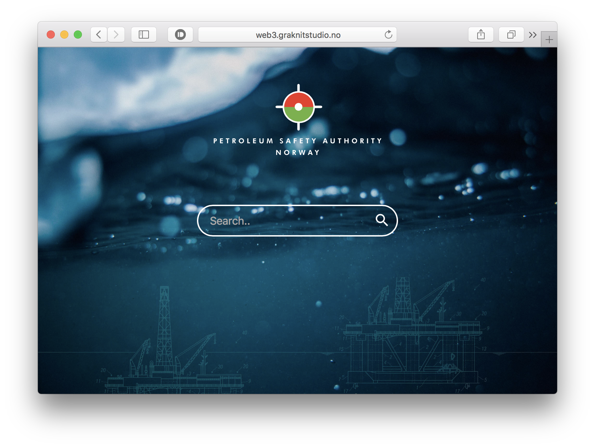

# webproj3
IMT3891 Webproject III – Group assignment



**This repository houses Group 1's solution to "Webproject 3", an assignment at NTNU** (Norwegian University of Science and Technology).

## Group members
@audunolsen, @susannews, @SiljeLien87 & @MartineJacobsen

### About our codebase
To view/work on this codebase locally, you'll need *Node*, *npm*, *Bower* and *GruntJS* installed. 

1. Clone the repository
1. Run npm install from the where you cloned the directory to
1. Run grunt
	* ```$ grunt``` to compile code once, making it browser compatible
	* ```$ grunt env``` to compile first if needed, followed by a watch event listening for changes. BrowserSync will also start, launching the project in your default browser.